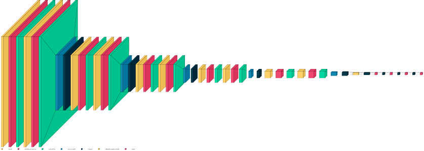

# TumorScan 🧠

> <i>Identifying and Classifying Brain Tumors Using Deep Learning</i>

TumorScan is a web app for medical students and professionals to easily and quickly check brain MRI scans for the presence of tumors, and classifies the type of tumor found in the scans.

## The Data

TumorScan uses a deep learning model trained on a dataset of 3000 images of brain MRI scans from 4 different categories:

1. Gliomas
2. Meningiomas
3. Pituitary Tumors
4. No Tumor (Healthy)


This dataset was created by <a href="https://rootcodelabs.com/">Rootcode Labs</a>.

## The Model

TumorScan uses a Convolutional Neural Network (CNN) comprised of 50+ layers and over 4 million parameters for inference. The architecture of this model has been inspired by pre-trained models such as ResNet-52, which are often used in transfer learning.

<br />



<br />

The deep architecture of this model ensures that it has captured patterns well during training, which is reflected in its performance:

1. Training Accuracy = 87.48%
2. Testing Accuracy = 89.98%

## Setup

### Prerequisites

Python (at least 3.9.0) must be installed on your system.

After Python has been set up, install the `virtualenv` package to create and manage a virtual environment for this project. This helps you maintain the project's dependencies in a hassle-free manner, without installing any unnecessary packages globally throughout your system.

```
pip install virtualenv
```

### 1. Clone the Project

Clone this project to create a local copy of it on your system:

```shell
git clone "https://github.com/Caramel-Labs/tumorscan.git"
```

Then, move into the project folder:

```shell
cd tumorscan
```

### 2. Create a Virtual Environment

Create a virtual environment inside the project folder to isolate its dependencies:

```shell
python -m venv env

# or

python3 -m venv env
```

Next, activate the virtual environment:

```shell
# on Windows:
.\env\Scripts\activate

# on MacOS or Linux
source env/bin/activate
```

You can deactivate this environment when you are done working with the project:

```shell
# on Windows, MacOS or Linux
deactivate
```

### 3. Install Dependencies

Set up your project with the necessary packages and libraries. After activating the virtual environment, enter the following command:

```shell
pip install -r requirements.txt
```

### 4. Start Streamlit

After you have completed the above steps, you can start the Streamlit app.

```shell
streamlit run app.py
```

Streamlit will start up in `localhost:8501`.

<hr />

This project is licensed under the <a href="https://github.com/Caramel-Labs/tumorscan/blob/main/LICENSE">Apache License</a>.
